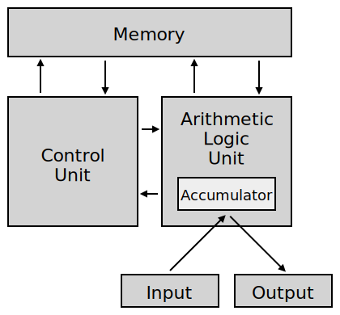

## **软件的层次化思想**
### **L1: 物质层：提供有用的物质特性，主要是电能**
- 能量转化：能量可以发生转化。例如： 动能可以转化为电能，电能转化为光能。
- 物质特性：存在一些物质一定条件下会发生固定规律的状态变化。
- 人类感知：人们对自然界观察达成了对自然数的通识，对光域，色域，声域的喜好感知。
- 总结根源：从本质上讲，软件或计算机是服务于人类的。
- 主要工作：材料科学与利用。

### **L2：参照坐标层：提供对物质特性的统一的度量 - 量化标准**
- 米：光在真空中（1/299 792 458）s时间间隔内所经过路径的长度。[第17届国际计量大会（1983）]
- 千克：国际千克原器的质量。[第1届国际计量大会（1889）和第3届国际计量大会（1901）]
- 秒：铯-133原子基态的两个超精细能级之间跃迁所对应的辐射的9 192 631 770个周期的持续时间。[第13届国际计量大会（1967），决议1]
- 安培：在真空中，截面积可忽略的两根相距1 m的无限长平行圆直导线内通以等量恒定电流时，若导线间相互作用力在每米长度上为2×10-7 N，则每根导线中的电流为1 A。[国际计量委员会（1946）决议2。第9届国际计量大会（1948）批准]
- 开尔文：水三相点热力学温度的1/273.16。[第13届国际计量大会（1967），决议4]
- 摩尔：是一系统的物质的量，该系统中所包含的基本单元（原子、分子、离子、电子及其他粒子，或这些粒子的特定组合）数与0.012 kg碳-12的原子数目相等。[第14届国际计量大会（1971），决议3]
- 坎德拉：是一光源在给定方向上的发光强度，该光源发出频率为540×1012 Hz的单色辐射，且在此方向上的辐射强度为（1/683）W/sr。[第16届国际计量大会（1979），决议3]
- 主要工作：理论研究，观测，实验

### **L3: 硬件层：提供通过机器指令控制物质的量化特性的功能 - 控制论**
- 二极管通电与否有的亮与不亮的形态变化。【承上：基于物质通电状态的量化特性】 
- 二极管配合其他电子元器件可以做各种元器件。【承上：基于物质通电状态的量化特性】
    1. 运算器（例如：加法器）
    2. 内存，存储器（例如：D锁存器，触发器）
    3. 控制器（例如：编码器/译码器） 

- 冯诺依曼体系结构：输入，输出, 控制器，存储器，运算器  
    

- 哈佛体系结构: 数据指令和代码指令在不同地址空间  
       

- 个人理解：【启下：提供人们操控物质特性的能力】
    1. **计算机为什么是二进制？因为将按照不同物质的通电状态划分为两种是最通用的**  
    2. **每种物质硬件都有自己的指令输入空间和数据输出空间。**
    3. **中央处理器输入和输出空间**
        ```sh
        # 人类端的输入：程序控制指令。（当下是二进制的机械码） 
        # 功能硬件端的输入：级联或者串联的各种设备。
        # 编码/译码器提供了硬件设备，中央处理器，人类语言的沟通桥梁，至于存储器则是物质在通电状态下可恢复可修改特性体现。
        ```
- 主要工作：电路设计

### **L4: 操作系统层：提供较高的硬件利用率**
- 分时复用，多租户，多进程操作系统

### **L5: 编译链接与编程语言：提供可读，开发效率更高的程序语言工具**
- 语言类型：面向过程，面向对象，面向函数

### **L5: 工程设计：提供可测试，高性能框架**
- 工程测试：质量的衡量控制标准
    1. 分层次测试：在物理层结构的每一次层上对单个组件进行测试。每个组件需要一个独立的测试驱动程序。
    2. 增量测试：组件接口发生新增时进行的测试。
    3. 回归测试：运行一个程序，给程序一组有明确预期结果集合的输入，比较结果。启发式算法会造成干扰。
    4. 层次编号在软件中的使用
        ```sh
        # 第0层：在我们的包之外的组件。
        # 第1层：没有局部物理依赖的组件。
        # 第N层：在物理上依赖的组件层次最高为N-1的组件。
        #
        # 通过层次编号我们可以计算积累组件依赖。
        ```
    5. 累积组件依赖（CCD）：对一个子系统内所有组件进行增量测试时，测试每个组件所需的组件数量总和。
        ```sh
        # 1. CCD可以用做系统耦合度指标。
        # 2. 相同数量的组件组织成垂直型，树型，环形，图形等不同结构系统，它们的CCD各不一样。
        # 3. 树型系统的CCD相对最低，我们可以通过CCD和组件数计算一个结构系统是否有环的存在。P[S1]103
        # 4. 物理循环依赖会带来较高的CCD。往后的物理设计和逻辑设计主要围绕 减少/去除物理依赖 展开。
        ```
        

- 工程层次化：由工程可测试性，稳定性引入了CCD，量化分析系统结构，导出层次化的重要性
    1. 物理循环依赖破化层次化的主因
        ```sh
        # 增强：两个组将通过 #include 指令 “相知”， 会引入循环物理依赖
        # 便利方法：基类（协议类）中的工厂函数问题
        # 抽象接口之间的内在耦合问题
        ```
    2. 解决物理循环依赖的方法
        ```sh
        # 升级
        # 简介：同一层次的组件把相互依赖的功能推到物理层次结构的更高层来消除循环依赖。
        # 方法：将底层子模块，组件之间的转换或者工厂关系通过静态成员结构的方式提取出来。有利于编译，链接，分层测试和组件解耦。
        # 好处：静态成员结构有利于编译，链接，分层测试和组件解耦。
        # 思想：静态升级；分层明确职责；接口/实现分离；依赖倒置-既不依赖分离前的基类，也不依赖新协议基类，而是依赖静态层。
        ```
        
        
        
        ```sh
        # 降级: 
        # 简介：把相互依赖的功能推到物理层次结构的低层来消除循环依赖。
        # 方法：可以对功能重新打包，这样可以恢复单向依赖。【这些组件的客户程序可能受影响 - P[S1]150】
        # 方法：将两个或多个静态工具中产生依赖的部分抽成一个独立的组件。而这些组件通过特殊方式（实现继承等）与该核心组件建立链接。
        ```
        DB追求的是少干扰

- 工程层次：
    1. 组件：由一个头文件和C文件组成。是逻辑设计和物理设计的基本单位
    ```sh
    # 组件的一些定义
    # 1. 将若干逻辑实体的抽象表现为个内聚单位。
    # 2. 组件的物理接口是它头文件中的所有信息。
    # 3. 组件的逻辑接口是以编程方式可访问或者可被用户检测到的。
    #
    # 组件的书写规则
    # 1. 每个组件的c文件都应该包含的它自己的h文件作为第一行独立代码。？P[S1]76
    # 2. 每个组件的c文件中带有外部链接的标识应该在h文件中显式声明。
    # 3. 每个组件的h文件除了继承外，尽量避免间接通过包含一个h文件去包含另一个h文件。
    # 
    # 组件间的依赖
    # 1. 编译时依赖：编译组件A的c文件时需要组件B的c文件，则称组件A编译依赖于组件B
    # 2. 链接时依赖：链接组件A的.o文件时需要组件B的.o文件，则称组件A链接依赖于组件B
    # 3. 一个编译时依赖几乎总是隐含一个链接时依赖。
    # 4. 逻辑实体的之间的IsA和HasA之类的关系，跨越组件边界总是隐含编译时依赖。
    # 5. 逻辑实体的之间的HoldA和Use之类的关系，跨越组件边界总是隐含链接时依赖。
    # 6. 逻辑实体之间的友元关系：远距离友元关系会带来的安全漏洞；局部友元关系会扩大类本身的接口。
    # 7. 逻辑实体之间的友元关系是组件内部的实现细节
    ```

### **L6: 功能实现**

### **参考书籍**
- S1: 大规模C++程序设计
- S2: 程序员的自我修养