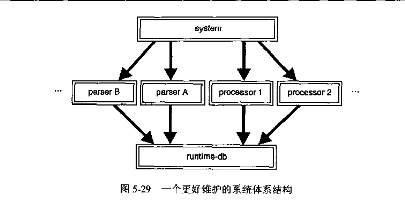
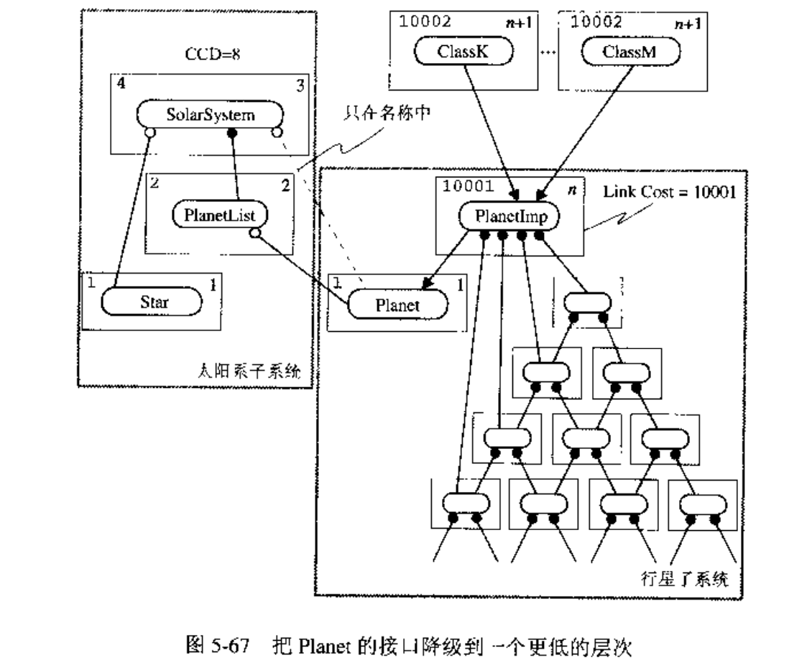

## **软件的层次化思想**

### **L1: 物质层：提供有用的物质特性，主要是电能**

- 能量转化：能量可以发生转化。例如： 动能可以转化为电能，电能转化为光能。
- 物质特性：存在一些物质一定条件下会发生固定规律的状态变化。
- 人类感知：人们对自然界观察达成了对自然数的通识，对光域，色域，声域的喜好感知。
- 总结根源：从本质上讲，软件或计算机是服务于人类的。
- 主要工作：材料科学与利用。

### **L2：参照坐标层：提供对物质特性的统一的度量 - 量化标准**

- 米：光在真空中（1/299 792 458）s时间间隔内所经过路径的长度。[第17届国际计量大会（1983）]
- 千克：国际千克原器的质量。[第1届国际计量大会（1889）和第3届国际计量大会（1901）]
- 秒：铯-133原子基态的两个超精细能级之间跃迁所对应的辐射的9 192 631 770个周期的持续时间。[第13届国际计量大会（1967），决议1]
- 安培：在真空中，截面积可忽略的两根相距1 m的无限长平行圆直导线内通以等量恒定电流时，若导线间相互作用力在每米长度上为2×10-7 N，则每根导线中的电流为1 A。[国际计量委员会（1946）决议2。第9届国际计量大会（1948）批准]
- 开尔文：水三相点热力学温度的1/273.16。[第13届国际计量大会（1967），决议4]
- 摩尔：是一系统的物质的量，该系统中所包含的基本单元（原子、分子、离子、电子及其他粒子，或这些粒子的特定组合）数与0.012 kg碳-12的原子数目相等。[第14届国际计量大会（1971），决议3]
- 坎德拉：是一光源在给定方向上的发光强度，该光源发出频率为540×1012 Hz的单色辐射，且在此方向上的辐射强度为（1/683）W/sr。[第16届国际计量大会（1979），决议3]
- 主要工作：理论研究，观测，实验

### **L3: 硬件层：提供通过机器指令控制物质的量化特性的功能（控制论）- 控制能力**

- 二极管通电与否有的亮与不亮的形态变化。【承上：基于物质通电状态的量化特性】
- 二极管配合其他电子元器件可以做各种元器件。【承上：基于物质通电状态的量化特性】
    1. 运算器（例如：加法器）
    2. 内存，存储器（例如：D锁存器，触发器）
    3. 控制器（例如：编码器/译码器）

- 冯诺依曼体系结构：输入，输出, 控制器，存储器，运算器  
    

- 哈佛体系结构: 数据指令和代码指令在不同地址空间  
    

- 个人理解：【启下：提供人们操控物质特性的能力】
    1. **计算机为什么是二进制？因为将按照不同物质的通电状态划分为两种是最通用的**  
    2. **每种物质硬件都有自己的指令输入空间和数据输出空间。**
    3. **中央处理器输入和输出空间**

        ```sh
        # 人类端的输入：程序控制指令。（当下是二进制的机械码） 
        # 功能硬件端的输入：级联或者串联的各种设备。
        # 编码/译码器提供了硬件设备，中央处理器，人类语言的沟通桥梁，至于存储器则是物质在通电状态下可恢复可修改特性体现。
        ```

- 主要工作：电路设计

### **L4: 操作系统层：提供较高的硬件利用率 - 硬件间的协作能力**
- 硬件是功能单一模块。操作系统协调各种硬件提提供分时，并发的功能。将分时，多用户出信息存入到储存硬件中
- 分时复用，多租户，多进程操作系统

### **L5: 编译链接与编程语言：提供可读，开发效率更高的程序语言工具。- 语言的生产力**

- 语言类型：面向过程，面向对象，面向函数

### **L6: 工程设计：提供可测试，高性能框架 - 工程的灵活度**

- 工程测试
    > **质量的衡量控制标准：由工程可测试性，稳定性引入了CCD，量化分析系统结构，导出层次化的重要性**
    1. 分层次测试：在物理层结构的每一次层上对单个组件进行测试。每个组件需要一个独立的测试驱动程序。
    2. 增量测试：组件接口发生新增时进行的测试。
    3. 回归测试：运行一个程序，给程序一组有明确预期结果集合的输入，比较结果。启发式算法会造成干扰。
    4. 层次编号在软件中的使用

        ```sh
        # 第0层：在我们的包之外的组件。
        # 第1层：没有局部物理依赖的组件。
        # 第N层：在物理上依赖的组件层次最高为N-1的组件。
        #
        # 通过层次编号我们可以计算积累组件依赖。
        ```

    5. 累积组件依赖（CCD）：对一个子系统内所有组件进行增量测试时，测试每个组件所需的组件数量总和。

        ```sh
        # 1. CCD可以用做系统耦合度指标。
        # 2. 相同数量的组件组织成垂直型，树型，环形，图形等不同结构系统，它们的CCD各不一样。
        # 3. 树型系统的CCD相对最低，我们可以通过CCD和组件数计算一个结构系统是否有环的存在。P[S1]103
        # 4. 物理循环依赖会带来较高的CCD。往后的物理设计和逻辑设计主要围绕 减少/去除物理依赖 展开。
        ```

        

- 工程层次：
    > **将工程划分为几层每一层解决具体的问题**
    1. 组件：由一个头文件和C文件组成。是逻辑设计和物理设计的基本单位

        ```sh
        # 组件的一些定义
        # 1. 将若干逻辑实体的抽象表现为个内聚单位。
        # 2. 组件的物理接口是它头文件中的所有信息。
        # 3. 组件的逻辑接口是以编程方式可访问或者可被用户检测到的。
        #
        # 组件的书写规则
        # 1. 每个组件的c文件都应该包含的它自己的h文件作为第一行独立代码。？P[S1]76
        # 2. 每个组件的c文件中带有外部链接的标识应该在h文件中显式声明。
        # 3. 每个组件的h文件除了继承外，尽量避免间接通过包含一个h文件去包含另一个h文件。
        # 
        # 组件间的物理依赖
        # 1. 编译时依赖：编译组件A的c文件时需要组件B的c文件，则称组件A编译依赖于组件B
        # 2. 链接时依赖：链接组件A的.o文件时需要组件B的.o文件，则称组件A链接依赖于组件B
        # 3. 一个编译时依赖几乎总是隐含一个链接时依赖。
        #
        # 组件间的逻辑关系。
        # 1. 继承关系：is-as
        # 2. 在接口中使用 use-in-interface：自由或成员函数的参数，返回值使用了该类型.
        # 3. 在实现中使用 use-in-implentment：use / has a / was a / hold a
        #       use: 成员函数中声明了该类型
        #       was-a: 私有继承
        # 4. 友元关系：远距离友元关系会带来的安全漏洞；局部友元关系会扩大类本身的接口。逻辑实体之间的友元关系是组件内部的实现细节。
        #
        # 组件间逻辑设计关系和物理依赖的关系
        # 1. is-a 和 has-a 逻辑实体之间关系，在跨越组件边界实现时总是隐含编译时依赖。【原因：直接是使用类型的实体，需要分配空间。所以在编译时必须知道类型的定义】
        # 2. uses 和 hold-a 逻辑实体之间关系可能隐含跨越组件的链接时依赖。【原因：引用/指针并不需要知道具体的类型定义，它们往往只是个地址，所以不会产生编译时依赖】
        # 3. was-a 一般在同一组件内不造成组件间的物理依赖。∂
        # 4. 在名称上使用某类型并不会导致编译时和链接时依赖。【use-in-name 事实上是 use-in-interface 和 use-in-implentment 中的某些特殊情况】
        #   
        # 组件间物理依赖简表
        # 1. 继承 -> 编译依赖。继承关系的类一般放在同一个组件内。
        # 2. 接口 -> 编译依赖或链接依赖。
        # 3. 实现 -> 链接依赖或无依赖
        # 4. 友元 -> 无依赖的但有其他问题。
        #
        # 逻辑设计出现循环依赖，通常意味着物理循环依赖。 意味着工程可能变得难以维护
        #
        # 要解决的问题
        # 1. 组件间的逻辑/物理循环依赖
        ```

- 层次化技巧：如何处理各层次面临的问题
    1. 解决组件物理循环依赖的方法
        ```
        #【组件物理循环依赖的主因】
        # 增强：两个组将通过 #include 指令 “相知”， 会引入循环物理依赖
        # 便利方法：基类（协议类）中的工厂函数问题
        # 抽象接口之间的存在耦合问题
        ```
        ```
        # 【主题1: 升级】
        # 简介：同一层次的组件把相互依赖的功能推到物理层次结构的更高层来消除循环依赖。
        # 方法：将底层子模块，组件之间的转换或者工厂关系通过静态成员结构的方式提取出来。有利于编译，链接，分层测试和组件解耦。
        # 好处：静态成员结构有利于编译，链接，分层测试和组件解耦。
        # 思想：静态升级；分层明确职责；接口/实现分离；依赖倒置-既不依赖分离前的基类，也不依赖新协议基类，而是依赖静态层。
        #
        # 其他相关例子：Shape
        # 下图中在基类Shape实现了工厂函数factory, 这导致了原本依赖于接口的结构变成了既依赖于接口又依赖于实现。
        # 改善版本将Shape的factory功能实现分离到静态的SpaceUtitl中。因为Static是公用的，所以对其修改并不影响的下层类的成员布局
        ```

        
        
        

        ```
        #【主题2: 降级】 
        # 简介：把相互依赖的功能推到物理层次结构的低层来消除循环依赖。
        # 方法：可以对功能重新打包，这样可以恢复单向依赖。【这些组件的客户程序可能受影响 - P[S1]150】
        # 方法：将两个或多个静态工具中产生依赖的部分抽成一个独立的组件。而这些组件通过特殊方式（实现继承等）与该核心组件建立链接。
        #
        # 其他相关例子： DB
        # 注： 途中涉及到将 parser 降级，但想提及的是另一个视角的降级：语言表达与计算机输入输出模型
        # 需求表达： 用户可以通过数据文件初始化出数据结构并对齐进行一些处理操作
        # 实现表达1: 用户通过处理器操作数据库的转换等其他行为
        # 实现表达2: 用户通过处理器处理数据库；用户通过转换器处理数据库。【符合‘输入-黑盒子-输出’逻辑】
        # 
        # 组件的‘输入-黑盒子-输出’模型
        # 1. ’输入/输出‘是功能使用者关心的视角：例如：API使用者
        # 2. ’黑盒子‘是功能代码实现者关心的视角：例如：派生类的开发人员
        # 3. 代码架构师视角：
        #     接口的封装：为API使用者提供便利：【减少上手难度】
        #     组件的隔离：为功能代码实现者提供便利：【提高编译/链接时的效率】
        #     安全性/保密性/灵活性
        #
        # 如何拆解需求实现组件 【目的：工程的高效，可维护]
        # 1. 识别需要中的名词和动词。主语/谓语/宾语
        # 2. 组织拆解成【输入-黑盒子-输出】的分句形式
        # 3. 按照不同语言特性进行翻译
        #       a. C语言：面向过程语言；程序基本单位：函数
        #           主要对于函数的 返回值/函数名/参数  组成部分的规划
        #   
        #       b. C++:  面向对象语言；程序基本单位：对象-类
        #           下面DB的中坏设计源于是使用了实现表达1，将转换行为和DB放在同一个类中。
        #           事实上DB的类定义可以带parse和process等操作，也可以不带。取决于我们对需求的拆解。
        #           当不带时，可以通过静态类，不透明指针粘结起来，这取决工程需要的灵活度。
        #
        #       c. 函数式语言： ...........
        ```
    
        
        

        ```
        # 降级的其他例子
        # library 的接口被 statutil 使用，其实现使用类reporter的接口
        # reporter 的接口被 library 使用，其实现使用类statutil的接口
        # 
        # 下图提供类两种降级方法：
        # 本质：
        # 1. 组件间逻辑设计上存在：接口依赖和实现依赖。这两种依赖会造成物理上的循环依赖。
        # 2. 将接口依赖降级
        #      原先的 library 分隔成 library 和接口repository 
        #      原先的 reporter 分离成 reporterImp 和接口reporterImp  
        # 3. 注意：下图3中对reporter的分解
        ```
        
        
        
        

        ```
        # 【主题3: 不透明的指针】
        # 简介：只在名称上使用，在的当前类不访问该指针的任何细节。既不会造成编译时依赖，也不会造成链接时依赖。
        # 本质：将物理依赖转换成协作，较低层次对象持有较高层次上使用的信息，同层次或上下层次之间的协作。
        # 问题：内存析构问题。例如：多个低层次对象的不透明指针指向高层次的同一个对象。高层次对象被析构，低层次仍然不知。
        # 需求：有时下层对象需要知道上层对象的信息。例如：在子窗口显示父窗口的统计信息。
        # 分析：使用升级和降级是最后结果是下层为上层提供服务。使用不透明指针结果则是下层需要上层相关信息，并且能良好解藕。
        # 要点：
        #   我们设计一个层次化工程时，可能给API使用者暴露多个层次的API。
        #   多个层次间的API通过类级别的静态成员函数链接起来。方便作为工具函数在类级别的层次上单用。
        #
        # 其他相关例子：
        # 一个被包含的对象拥有一个指向它容器的指针，并且要实现那些实质地依赖那个容器的功能，那么我们可以通过以下方法来消除相互依赖。
        # 1. 让被包含类的指针不透明。
        # 2. 在被包含类的公共接口上提供对容器指针的访问。【是否要声明为const 函数】
        # 3. 将被包含类的受影响的方法升级为容器类的静态成员。【在高层次，通过静态成员函数获得了某个低层次对象相关的某些高层次信息】
        ```

        ```
        #【主题4: 哑数据】
        # 简介：一个对象拥有但不知道如何解释的任何种类的信息都是哑数据。
        # 本质：对不透明指针的一种泛化。
        # 作用：用于打破组件间名字上的依赖。例如：可以通过索引来替代不透明指针。
        # 缺点：牺牲一定程度的类型安全。
        # 优点：典型的优化手段。例如：用short索引对象比使用不透明指针更节省空间。
        ```
        
        

        ```
        #【主题5: 冗余】
        # 简介：冗余很少没有开销。其开销通常以增加一个新的物理依赖出现。
        # 场景：一个组件使用另一个组件压要考虑的问题。
        #   1. 解除组件间物理循环额依赖。
        #   2. 降低组件内部自身的CCD
        #
        # 需求：如何降低组件内部的CCD？我们可以从两方面入手：下级组件对象的存储和它们的客制化操作
        # 做法：
        #   1. 在当前组件声明下级对象的 ManageMent 类。
        #   2. ManageMent类提供一些接口，这些接口用调用组合下级对象接口，实现客制化功能，并将其放到本组件的shapequeue数组中。
        #   3. shapequeue数组存放shape的指针并且不对shape进行任何实质操作，所以shape对shapequeue是不透明的。【将存储和客制化操作分离】
        #   4. 此外，如果下级对象有必要知道上级组件信息，则可以让下级对象持有上级组件的不透明指针。
        #
        # 冗余的体现：
        #   1. 如果shapequeue只存shape的不透明指针，那么shapemanagemnet之外其它模块要获取数据时，将需要借助shapemanagemnet，
        #   2. 意味着shapequeue需要通过shapemanagemnet间接访问shape的数据。
        #   3. 所以shapemanagemnet需要将shape的数据拷贝送入shapequeue中，供当前组件内部的其它组件使用。
        #   4. 而shapemanagemnet通过shapequeue中的不透明shape指针管理更新 shape 对象的实时信息。
        ```
        ```
        # 例子：
        # 下图shape实现了area()接口
        # 逻辑上 shapequeue 不应该继承 shape
        ```
        
        ```
        # 改进版本：
        # 将area()接口交由 shapeManageMent 类
        # 在shapequeue中通过 shapeManageMent 缓存多一份 area 数据
        # 结果：新增了物理依赖，降低了CCD
        # 优化：shapeManageMent 不应该继承 shape, 而是在接口中使用或者实现中使用。
        ```
        

        ```
        #【主题6: 回调】
        # 简介：回调是由API使用者提供给底层组件使用的函数。【黑盒子的输入既可以数据也可以是行为】
        # 作用：消除对大型子系统的依赖。
        #      【本质：通过名称上使用（不透明指针）消除大型子系统的物理依赖，同时带来了对象析构的内存问题。回调可以解决这个问题】
        # 
        # 1.避免回调必要使用的例子
        # 2.虚函数是一种回调机制。名称上的使用可以带来类型上的安全。
        #   【面向对象基本类型的结构设计要点】
        #    a. 抽象基类声明了功能却没有提供实现【viritual机制】
        #    b. 声明了作用对象类型却没有提供点的组成细节【名称上使用】
        #    c. 同时提供了类型安全
        # 3. 类型安全的健壮性代码写法 
        ```
        
        
        

        
        ```
        #【主题7: 管理者类】
        # 简介：建立与低层次对象的所有权，使系统易于理解和维护。【类之间的支配和协作关系的表达】
        # 概述：
        #   1. List的两种实现为例介绍了类间支配关系带来的问题
        #       Q1：抽象级别太低。
        #       Q2: 未能封装List的私有实现细节。- API使用者不愿意为管理单独链接内存的低层次细节费心。
        #       Q2.1: 从属类的角色可能被滥用。- 析构的方式不对。模糊了类间从属关系的表达。
        #
        # 思维：
        #   1. 实现抽象的类。
        #   2. 用于执行策略，管理内存，协调实现类的管理类。
        #   
        # 本质：【公司普通员工的雇佣和解雇的案例 - 普通员工没有解聘/雇佣的职权，也不能互相解雇】
        #   1. 管理者知道它的下属类，反之则不行。
        #   2. 管理者知道它的下属类的方式：友元。 
        #   3. 有两种方式可以消除友元类的影响。【下个主题详细描述】
        #       a. 隔离循环依赖独立出新的组件
        #       b. 封装升级整个子系统 【注意：这里的对象是整个子系统】
        ```
        
        
        

        ```
        #【主题8：分解 - 层次化/可重用】
        # 简介：提取小块内聚功能并且将它们移到较低层次。用于减轻循环依赖，获得重用性
        # 分解角度：
        #   1. 实现抽象的类：
        #       a. 抽象类 【前述：基于名称上使用和虚函数回调的基本类型实现方法】
        #       b. 实现抽象的类 【分解的着手点：值语义】
        #
        #   2. 管理者类：需要一个数据结构来存储对象间的关系。【分解的着手点：该数据结构的通用/特化】
        #
        # 备注：分解可以让我们对代码的实现和类之间职能关系更加清晰。
        #
        # 其他：
        #   1. 一方面，将「实现抽象的类」的构造函数声明为private，同时授予「管理者类」为友元，有利于封装。
        #   2. 另一方面，友元关系会给「实现抽象的类」和「管理者类」带来物理耦合。
        #   3. 物理耦合和物理依赖的区别：
        #       a. 声明友元关系并不会为当前组件带来物理依赖.
        #       b. 友元关系是带来物理耦合的唯一原因。
        #       c. 物理耦合要求相关类需要被安置在同一物理组件中，否则将会带来安全问题。例如：远距离由友元关系。
        ```

        ```
        # 节点中对边的关系是不具备值语义的。所以可以/应该对「实现抽象的类：节点类/边类」进行分解。
        ```
        

        ```
        # 房屋的位置属性对房屋来是不具备值语义的。所以可以/应该对「实现抽象的类：房屋」进行分解。
        ```

        

        ```
        # 图中bag部分的分解是管理者类graph对「实现抽象的类」之间「逻辑管理关系」的分解实现 
        ```

        

        ```
        #【主题9: 封装升级 - 层次化/可重用/去物理耦合（友元关系）】
        # 简介：一个接口的内存实现细节对于客户来说是不可编程访问的则称其为封装
        # 重点：什么是细节？什么不是细节？去取决于物理层次结构的抽象级别。哪些客户关心哪些细节？
        # 分析：
        #   法1. 私有继承同时赋予管理者类友元关系的做法，对API使用者提供了封装性，但对类的开发维护者却暴露了Gnode 和 Gedge 的很多细节。
        #   法2. 使用私有头文件 - 即：构造函数为共有，但不为开发者提供Gnode/Gedge的头文件，只在Graph中暴露头文件供Gnode 和 Gedge 使用。
        #  
        # 纠正：
        #   1. 封装一个类型：封装的是一个类型的使用而不是类型本身。即：我们知道一个类型但不知道如何编程访问。
        #   2. 不提供头文件（私有头文件）是隐藏一个类型；不属于封装。此外，这种做法并不能真正的隐藏一个类型。
        # 
        # 纠正：
        #   1. 封装处理是的实现细节；隔离处理的是物理依赖。
        #   2. 不提供头文件是隔离的手段，可以处理物理依赖问题，但无法实现封装。【见下图例子】
        ```
        ```
        # 组件级封装的例子
        ```
        
        ```
        # 隐藏头文件不是封装 - 并排重用问题
        # 下图：
        # 1. 隐藏S的头文件。我们的设计初衷是：在E中我们需要通过上层传入获取S的对象。在上层N中管理对象
        # 2. 可事实上，我们可以通过同一层次的的W组件的接口获得S对象，然后传给E。
        # 3. 结果：隐藏头文件，存在并排重用问题，允许我们绕开管理层N，破坏了封装。
        #
        # 注：
        #   通过不提供头文件可以是类型不透明。但即使是不透明的名称上的使用，在并排重用的作用下，使我们的封装初衷被破坏。
        #   破坏封装不一定暴露细节。此处没有暴露S的编程可访问接口细节。
        #   破坏封装的定义应该是：存在某种可编程的方式，违背了封装的初衷。
        ```
        

        ```
        # 【工程层次化开发流程】
        #  1.【更好的工程灵活性】
        #      【思维角度：输入-黑盒子-输出】
        #       a. 将需求翻译成计算机语言：输入-黑盒子-输出。做好功能组件划分。
        E
        #  2.【转移循环依赖】
        #      【思维角度：接口/实现】
        #       a.【更好的编译/链接性能】：识别组件中的接口依赖和实现依赖，通过升级/降级去除物理循环依赖。
        #
        #  3.【删除物理意义上的概念依赖】
        #      【思维角度：封装/性能】
        #       a.【更好的功能封装性】：使用不透明指针让组件的功能更加内聚，专一。
        #       b.【更好的运行时性能】：识别组件间的名字上循环依赖，权衡是否通过哑数据优化。
        #
        #  4.【防止不必要的物理依赖】
        #      【思维角度：层间冗余/封装】
        #       a.【更好的可维护性/层与层之间的隔离】：识别组件间高CCD依赖节点，进行冗余优化。
        #       b.【更低子系统CCD/类型安全】：通过虚函数机制实现回调完成对基本类型概念上的抽象约束；通过回调消除不透明指针在降低子系统CCD时带来的影响
        #
        #  5.【高效，可测试，和重用的封装层次】：
        #      【思维角度：类间的支配/协作关系】
        #       a.【良好的层与层之间关系】：管理类协调实现抽象类之间的支配和协作关系。
        #       b. 分解封装：实现抽象类的值语义分解；管理类存储关系的数据结构的通用/特化分解
        #       c. 升级封装：合理的封装各接口/合并层次化各组件。方法：隐藏头文件/私有继承/包装器
        ```

### **L7: 功能实现 - 算法的高效性**

### **参考书籍**

- S1: 大规模C++程序设计
- S2: 程序员的自我修养

### **相关案例**
> **从层次化之外的角度学习案例**
- DB数据库设计：【输入-黑盒子-输出 / 回调的不良设计】
- 赛马程序设计：【哑数据/名字上循环】
- 图形工厂程序设计：【升级/接口与实现分离/层次化】
- 底层库报告模块设计：【接口降级】
- 图形管理类设计：【冗余】
- 太阳系模型设计：【回调】
- 面向对象的基本类型设计：【回调】


