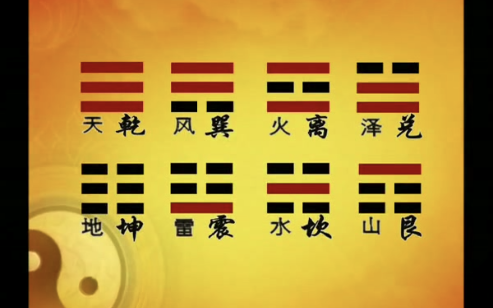
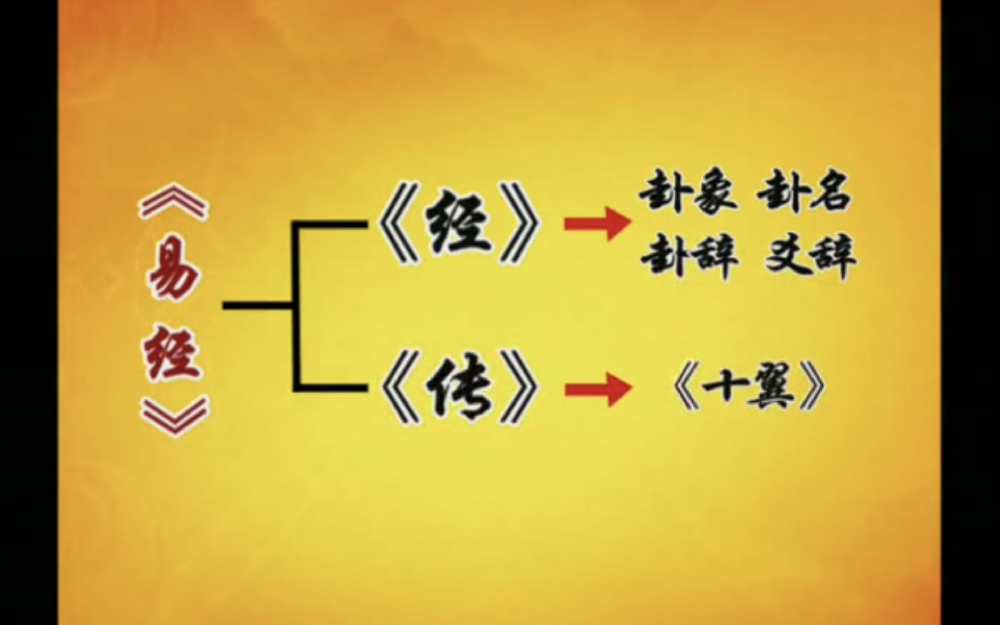
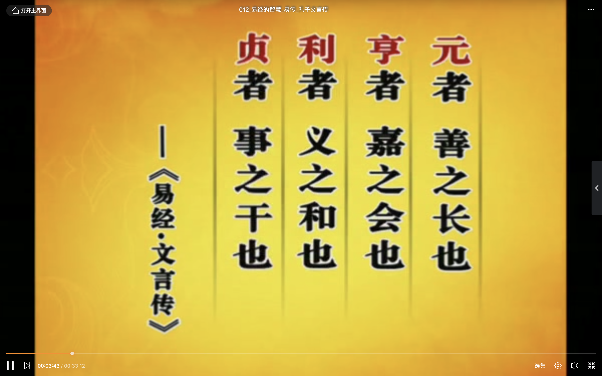

## **易经**
### **龙马伏图**
> **从象，数，气，理解释河图洛书**
- 中华文化的根源：河洛文化
    1. 黄河-龙马-河图
    2. 洛水-神龟-洛书

- 河图
    1. 河图【相差5】
    
    2. 黑白点：象
    3. 河图歌 
    

- 气是最初的东西
    1. 象和数不是最初的东西。
    2. 气到哪数就到哪，气数在天称象，气数在地称形。
    3. 气有阴阳

- 五行：气的流行/气由无形的能和有形的质
    1. 水向下，火向上，金向内，土向平行，木向外
    2. 偏重五行的生化作用而不是生克作用
    

- 人不要总是觉得我创造，都是向大自然学习

- 顺其自然，不要听其自然。还是要做。


### **神龟背书**
> **从象，数，气，理解释河图洛书**
- 洛书
    1. 河洛关系  
    
    2. 洛书歌  
    
    3. 天下九州  
    4. 四奇正四偶隅八卦  
    
    5. 河图中的数    
         
        ```
        # 对角相加十，中央不变五
        # 用五藏十，持经达变
        # 现代人盲目求变，应该要有所变，有所不变
        ```

          
    6. 河图中的四象  
        ```
        # 1. 阳顺时针：1 -> 3
        # 2. 阳逆时针：7 -> 9
        # 3. 阴顺时针：8 -> 6
        # 5. 阴逆时针：4 -> 2
        #
        # 人的逆取顺守和顺取顺守
        ```
          

    7. 中国人的不变：勤劳，节俭，忠诚，负责
        ```
        # 以前中国人没有奢侈的说法
        # 朱门 - 炫耀 - 败坏社会风气
        #
        # 不能盲目鼓励孩子变，应该有所变有所不变。
        ```
        
### **天人合德**
> **天垂象，个人去领悟**
- 引子
    1. 天垂象  
    

    2. 君子三畏  
        

        ```
        # 圣人： 伏羲，周文王
        # 伏羲：从象得出天道
        #
        # 周文王：从天道得出人道 （卦辞/爻辞）
        #   贡献：指出人不应该和动物不一样；人类社会中的人道，有政治。
        #
        # 孔子：人生的行事规则（万世师表）
        #   贡献：人和禽兽的区别在于有伦理道德
        #   天人怎么合-？伦理道德，拓展人际关系中不断的修德
        #
        # 大人：有道德的人
        #  先天而天弗违，后天而天不违
        #  安身立命，大位天定
        #  占卜作用让易经道德性变成知识性，
        #  趋吉避凶变成投机取巧。
        #  事实上该做的还是要做的。
        #
        ```

        

        ```
        # 中国人都有的个性：中国人都希望自己说了算
        # 人在小事说了算就已经很了不起了
        ```
        
        ```
        # 孔子自述：自己只是描述古人的智慧。
        # 孔子的贡献：撇开神道设教，将易经的道理讲述为人生行事规则。
        ```
        

### **以人为本**
- ”龙马伏图，神龟背书“是编造的。真假又怎么样，重要的是用起来。

- 有所变有所不变
    1. 教小孩：以你现在的年龄，这回事是对的，长大以后会有不同看法
    2. 因时，因地，因人，因事而变。不能铁口直断 -> 要准备多种解释。
    3. 【先天的生化作用-1-水有源】河图洛书中1，3，5数位置的不变。即对应自然中：水，木，土的不变。
    4. 【后天的生化作用-3-木有本】
    5. 【队伍】：掌握得了的，能一起做事，否则，只是形式上的一盘散沙。
    6. 【中国人对宗教的理解】：大同小异。劝人为善。
    7. 【法治/理治/德治】：理治/德治以法治为基础。 
    8. 理治：合理就好
        ```
        # a. 和谁的理? 无三不成理 - 天理/人理/地理
        # b. 为谁而活？一方面为自己而活，一方面为别人而活
        # c. 为什么不要立即做决定，为什要试探？事缓则圆：太顺要考虑是不是真的，太抵抗要思考里面有什么问题
        ```
    9. 【大致如此】：
        ```
        # 人的表达/理解有限 -> 言不由衷
        # 人能做到大致如此，就很了不得，没有千真万确
        # 差不多（不用全要，但差一点都不行）
        ``
    10. 以人为本ß
        ```
        # 西方人的学问：为了学问而学问，追求真理，忽略能否为人所用，是否对人有伤害
        # 中国人的学问：以人为本
        #   64卦：64种情景
        #   每卦由6爻组成，分天/地/人3道，中间4爻人力可及
        #
        #   吉凶祸福，因人而现 -> 学问因人而做。 
        ```

### **阴阳之道**
- **一阴一阳谓之道**
    1. 人从哪里来
    ```
    # 西方人：神本位 - 每个人都是平等的服从上帝的戒律 - 所以形式法治社会。
    # 中国人：神明 - 帮助我们去明白道理 (神而明之)
    # 
    # 自天佑之，吉无不利：
    #   1. 自己去了解天理，去顺从自然，将会比较吉祥。
    #   2. 一切都是人想出来的
    #   3. 伏羲 - 通过想象观察天地日出日落想象出 易经 系统
    #       a. 一划太极：自然运转的规律
    # 
    ```
    
    
    

### **八卦定乾坤**
- **八卦演变**   
      
    ```
    # 天：乾三连：刚健 - 恒久的刚强 - 不轻易放弃
    # 地：坤六断：柔顺
    # 天下面动风：巽下断：奇/入
    # 天中面动火：离中虚：到最后自己不见了
    # 天中面动泽：兑上缺：喜悦
    # 地下面动雷：震仰盂：震动
    # 地中面动水：坎中满：怕它/又离开不了
    # 地中面动山：艮覆碗：停止
    ```
    

### **易经与命运**
- **人为万物之灵**
    ```sh
    # 周武王：人为万物之灵。破除当时的迷信。人和动物不一样的在于人可以改变自然
    # 孔子：民可使由之，不可使知之。让当时的老百姓完全听得懂道理相当困难。 进而推出祭祀。
    # 易经：术数 + 易理。
    # 看到尼姑倒霉，寺庙开偏门，踩门槛等迷信/偏见，在在于看的人是否合理。
    # 自天佑之，吉无不利。算命是为了趋吉避凶，要发发挥人的主动性。
    # 慎断是非：因为事情有灵活性，模糊性，空白性。留白是为了尊重看的人。
    # 人生是要经历艰难险阻，如果一辈子都很顺，只学会了吃喝玩乐，那你这一生很平淡单调。
    ```
    

- **破解占卦**
    ```
    # 孔子：不占而矣
    # 不要完全相信占卜的结果。
    # 通过占卜去学习一个卦。
    #
    # 卜卦的目的：找到自己的定位，做到旁观者清。
    #  
    #  先生才，病人福
    ```
    
    
    
    ```
    # ’七上八下‘说法来源
    # 阳：在易经里为9
    # 阴：在易经里为6
    ```
    
    ```
    # 我们用：时，位，性质表示一个爻。
    # 时比较重要
    #
    # 卜算6次形成一卦。数字有阴阳
    ```  
    

### **乾坤易之门**
- 乾坤大门
    ```
    # 卦分三类：纯阴，纯阳，有阴有阳
    # 乾坤二卦演变62卦
    # 女儿长得象父亲
    # 儿子长得象母亲
    ```
    
    
     

    ```
    # 重卦：上卦代表能量/下卦代表物质
    # 爻是否当位的判断。下图
    ```  
    
    
       
    
    ```
    # 乾卦和坤卦都有不当位，所以天地才有交合ß演化
    ```
   
   ```
   # 初未知/上易知：小时了了，大未未必佳
   # 五多功/二多誉：功劳给领导，下属获得赞誉
   # 三多凶/四多惧：上下卦的渐变
   ```
   

### **乾卦六龙**
- **龙-变化莫测/难缠/神通广大**
    ```
    # 人生发展的六个阶段
    ```
    
    
    ```
    # 潜龙：初难知
    #   1. 刚刚冒出来，将来会怎么样，谁也料不到
    #   2. 刚冒出来的人，他自己也没把握自己会怎么样
    #   3. 外界环境对环境是怎么样的也不明确
    #
    # 初九爻辞：潜龙勿用
    #   1. 是不是龙？天行健，君子以自强不息。
    #   2. 入乡问俗。不是不清楚，而是了解对方知道什么程度，自己要在哪种层次去配合。了解因时因地有什么变化？
    #   3. 诸葛亮不下山，刘备说：”你不下山，天下的苍生怎么办？“。【如果刘备说为他自己，大概率还是请不诸葛亮】
    #  
    # 九二爻辞：显龙在田，利见大人
    #   1. 一出来就是大人， 而不是‘抱歉，抱歉，我来历练几年’。
    #   2. 一个人表现的好，容易遭打击
    #   
    # 九三爻辞：君子终日乾乾，夕惕若厉，无咎  
    #   1. 敌人在暗处【没有对手的人，本身是没有威胁，没成就】
    #   2. 要小心翼翼，爱惜羽毛 【珍惜积累，不要自毁长城】
    #
    # 九四爻辞：或跃在渊，无咎
    #   1. 要么飞上去，要么跌入谷底
    #   2. 拱你，抬你，抬轿子的人把你抬哪里，就有些由不得自己
    #
    # 九五爻辞：飞龙在天，利见大人
    #   1. 记住：适可而止
    #
    # 九六爻辞：亢龙有悔
    #   1. 小心脱离群众
    #
    #【能力不等于本事】
    ```
    

### 六龙御天
- **六：代表不顺。无法掌控；所以才要期盼：六六大顺。**
    1. 潜龙勿用：出生到出社会之前。积累学问，基本功。
        ```
        # 潜得不久：每个人命运不同，有些人比较早出来打工/家庭原因。
        # 潜得久：自身不努力 - 温室里的花朵
        ```

    2.  显龙在田，利见大人
        ```
        # 利见大人：表现的好不好，主要上面的人看你顺不顺眼。
        # 上面没人支持你，你怎么知道怎么做？- 朝中无人莫做官。
        # 注意：不能表现过度，避免过犹不及。
        ```

    3. 君子终日乾乾，夕惕若厉，无咎
        ```
        # 在人道就不叫龙了。
        # ’你说取荆州，我刘备就听你取荆州？‘ 刘备样样要听你，那刘备算什么？
        # 小老板一生就是下乾。每个人都有自己的分。
        ```

    4. 或跃在渊，无咎
        ```
        # 抉择进不进入乾卦
        ```

    5. 飞龙在天，利见大人
        ```
        # 要有一些核心团队，要找九二的人支持。
        # 我能掌控的已经触到边界
        ```

    6. 亢龙有悔
        ```
        # 帝王越老越昏庸
        ```
       
        ```
        # 元：慎始，谋定而后动，动机要纯正。
        # 亨：互通有无 - 受‘元’是否有做好。 处事要谨慎。
        # 利：利益合理分配。
        # 贞：固正的操守 - 男/女都要守。
        #
        # 元/亨/利是自然给的，贞是人特有的。
        ```

### 孔子-文言传
- 人更三圣，世历三古 《汉书-艺文志》
    ```
    # 上古：伏羲
    # 中古：周文王
    # 近古：孔子
    #
    # 《文言传》- 孔子解释文王所下的卦辞 
    ```
    
    
    
    ```
    # 元：元始/开始。要做堂堂正正的人。
    # 亨：嘉-美的意思。互通有无，把美好的东西汇聚在一起。我们各有所能，各取所需。
    # 利：赚钱并不可耻是可爱的。赚钱靠机会，花钱是靠智慧。上天考验你的义。功过不相抵。
    # 贞：
    #   1. 正直 != 守规矩。
    #   2. 一段时间的正直没用。社会是大染缸？有社会环境的原因，也有自己的愿景不坚定的原因。出淤泥而不染。
    #   3. 曲是直必要的过程。
    #   4. 有话就说，有话直说，你管他什么反应。== 目中无人
    #   5. 外圆内方。 
    ```
    
    
    
    ```
    # 两把刷子：能屈能伸，刚柔并济
    # 人是活在希望中，不是活在梦想中。
    ```
    


